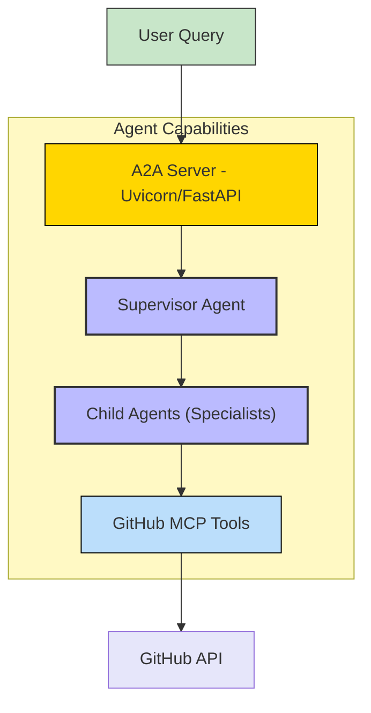
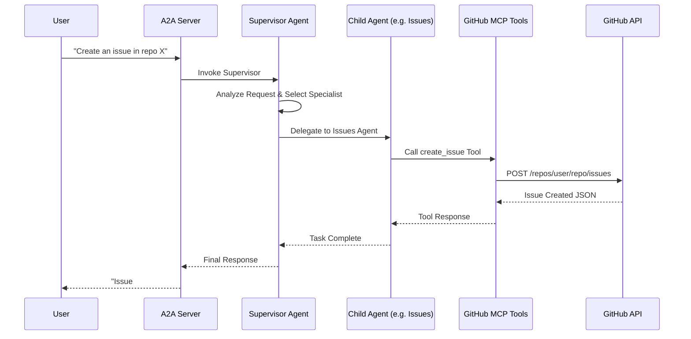

# GitHub Agent - A2A | AG-UI | MCP


*Version: 0.1.1*

## Overview

**GitHub Agent** is a powerful **Model Context Protocol (MCP)** server and **Agent-to-Agent (A2A)** system designed to interact with GitHub.

It acts as a **Supervisor Agent**, delegating tasks to a suite of specialized **Child Agents**, each focused on a specific domain of the GitHub API (e.g., Issues, Pull Requests, Repositories, Actions). This architecture allows for precise and efficient handling of complex GitHub operations.

This repository is actively maintained - Contributions are welcome!

### Capabilities:
- **Supervisor-Worker Architecture**: Orchestrates specialized agents for optimal task execution.
- **Comprehensive GitHub Coverage**: specialized agents for Issues, PRs, Repos, Actions, Organizations, and more.
- **MCP Support**: Fully compatible with the Model Context Protocol.
- **A2A Integration**: Ready for Agent-to-Agent communication.
- **Flexible Deployment**: Run via Docker, Docker Compose, or locally.

## Architecture

### System components



### Component Interaction



## Specialized Agents

The Supervisor delegates tasks to these specialized agents:

| Agent Name | Description |
|:-----------|:------------|
| `GitHub_Context_Agent` | Provides context about the current user and GitHub status. |
| `GitHub_Actions_Agent` | Manages GitHub Actions workflows and runs. |
| `GitHub_Code_Security_Agent` | Handles code security scanning and alerts. |
| `GitHub_Dependabot_Agent` | Manages Dependabot alerts and configurations. |
| `GitHub_Discussions_Agent` | Manages repository discussions. |
| `GitHub_Gists_Agent` | Manages GitHub Gists. |
| `GitHub_Git_Agent` | Performs low-level Git operations (refs, trees, blobs). |
| `GitHub_Issues_Agent` | Manages Issues (create, list, update, comment). |
| `GitHub_Labels_Agent` | Manages repository labels. |
| `GitHub_Notifications_Agent` | Checks and manages notifications. |
| `GitHub_Organizations_Agent` | Manages Organization memberships and settings. |
| `GitHub_Projects_Agent` | Manages GitHub Projects (V2). |
| `GitHub_Pull_Requests_Agent` | Manages Pull Requests (create, review, merge). |
| `GitHub_Repos_Agent` | Manages Repositories (create, list, delete, settings). |
| `GitHub_Secret_Protection_Agent` | Manages secret scanning protection. |
| `GitHub_Security_Advisories_Agent` | Accesses security advisories. |
| `GitHub_Stargazers_Agent` | Views repository stargazers. |
| `GitHub_Users_Agent` | Accesses public user information. |
| `GitHub_Copilot_Agent` | Assists with coding tasks via Copilot. |
| `GitHub_Support_Docs_Agent` | Searches GitHub Support documentation. |

## Usage

### Prerequisites
- Python 3.10+
- A valid GitHub Personal Access Token (PAT) with appropriate permissions.

### Installation

```bash
pip install github-agent
```
Or using UV:
```bash
uv pip install github-agent
```

### CLI

The `github-agent` command starts the server.

| Argument | Description | Default |
|:---|:---|:---|
| `--host` | Host to bind the server to | `0.0.0.0` |
| `--port` | Port to bind the server to | `9000` |
| `--mcp-config` | Path to MCP configuration file | `mcp_config.json` |
| `--provider` | LLM Provider (openai, anthropic, google, etc.) | `openai` |
| `--model-id` | LLM Model ID | `qwen/qwen3-4b-2507` |

### Running the Agent Server

```bash
github-agent --provider openai --model-id gpt-4o --api-key sk-...
```

## Docker

### Build

```bash
docker build -t github-agent .
```

### Run using Docker

```bash
docker run -d \
  -p 9000:9000 \
  -e OPENAI_API_KEY=sk-... \
  -e MCP_CONFIG=/app/mcp_config.json \
  knucklessg1/github-agent:latest
```

### Run using Docker Compose

Create a `docker-compose.yml`:

```yaml
services:
  github-agent:
    image: knucklessg1/github-agent:latest
    ports:
      - "9000:9000"
    environment:
      - PROVIDER=openai
      - MODEL_ID=gpt-4o
      - OPENAI_API_KEY=${OPENAI_API_KEY}
    volumes:
      - ./mcp_config.json:/app/mcp_config.json
```

Then run:
```bash
docker-compose up -d
```

## Repository Owners


